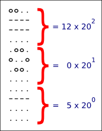

# Maya calcul

### Objectif

Suite à la découverte d'un nouveau site maya, des centaines de livres de mathématiques, de physique et d'astronomie ont été mis au jour.

La fin du monde pourrait arriver plus vite que prévue, nous avons besoin de vous pour en être certain !

Ainsi, pour automatiser la vérification des calculs scientifiques maya, on vous demande de mettre au point un programme capable de réaliser les opérations arithmétiques basiques entre deux nombres maya.

### Regles

La numération maya comprends `20` chiffres allant de`0` à `19`.

Voici un exemple ASCII de leur représentation :

zero:

```
.oo.
o..o
.oo.
....
```

one:

```
o...
....
....
....
```

two:

```
oo..
....
....
....
```

three:

```
ooo.
....
....
....
```

four:

```
oooo
....
....
....
```

five:

```
....
----
....
....
```

six:

```
o...
----
....
....
```

seven:

```
oo..
----
....
....
```

heigh:

```
ooo.
----
....
....
```

nine:

```
oooo
----
....
....
```

ten:

```
....
----
----
....
```

eleven:

```
o...
----
----
....
```

twelve:

```
oo..
----
----
....
```

thirteen:

```
ooo.
----
----
....
```

fourteen:

```
oooo
----
----
....
```

fithteen:

```
....
----
----
----
```

sixteen:

```
o...
----
----
----
```

seventeen:

```
oo..
----
----
----
```

eighteen:

```
ooo.
----
----
----
```

nineteen:

```
oooo
----
----
----
```

Un nombre maya est divisé en sections verticales. Chaque section contient un seul chiffre (de 0 à 19) représentant une puissance de 20.

La section la plus basse correspond à `200`, celle au-dessus à `201`, et ainsi de suite...

Ainsi dans l'exemple ci-dessous, le nombre maya représenté vaut :

```
(12 x 20 x 20) + (0 x 20) + 5 = 4805
```



Pour corser le problème, les mayas utilisaient plusieurs dialectes et la représentation graphique des chiffres varient d'un dialecte à l'autre.

La représentation des chiffres maya sera fournie en entrée de votre programme sous forme de caractères ASCII.

Vous devrez afficher le résultat de l'opération entre les deux nombres maya fournis. Les opérations possibles sont `*`, `/`, `+`, `-.

Un nombre maya est divisé en sections verticales. Chaque section contient un seul chiffre (de 0 à 19) représentant une puissance de 20.

La section la plus basse correspond à `200`, celle au-dessus à `201`, et ainsi de suite...

Ainsi dans l'exemple ci-dessous, le nombre maya représenté vaut :

```
(12 x 20 x 20) + (0 x 20) + 5 = 4805
```

Pour corser le problème, les mayas utilisaient plusieurs dialectes et la représentation graphique des chiffres varient d'un dialecte à l'autre.

La représentation des chiffres maya sera fournie en entrée de votre programme sous forme de caractères ASCII.

Vous devrez afficher le résultat de l'opération entre les deux nombres maya fournis. Les opérations possibles sont `*`, `/`, `+`, `-.
